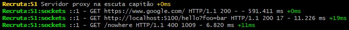

## recruta-proxy

---

http/1.1 localhost proxy

Direciona quaisquer **cors requisições** http para a internet

- aceita verbos "GET, PUT, PATCH, POST, DELETE"

---

### USO (INSTRUÇÕES)

- Como dependência em um projeto:

1. Instale o pacote `npm install --save-dev recruta-proxy`
2. Instancie o servidor, chamando a função **default**, invoque-a com os argumentos opcionais _porta (`44`)_ e _opcoes_.
3. Utilize a função **urlProxy** exportada do pacote para obter o URL de chamada do Proxy.
4. Utilize a função **cabecalhosProxy** para obter o cabeçalho _endereco-alvo_ do Proxy e destruturar no objeto `Headers` da requisição http, este também pode ser predefinido em _opcoes_.

- Executando local:

1. Clone e instale os pacotes `git clone https://github.com/goth-d/recruta-proxy`, `cd recruta-proxy`, e `npm install`.
2. Rode com `npm start` e defina opcionalmente a variável `PORT`, ou `npm run dev` para daemonizar com **pm2**.
3. Defina, opcionalmente, uma porta na variável `PORT` no comando para rodar, ou caso rode com o **pm2** no objeto _env_ de `ecosystem.config.cjs`.
4. Para modificar os cabeçalhos padrões que são purgados revise `util.js`.
